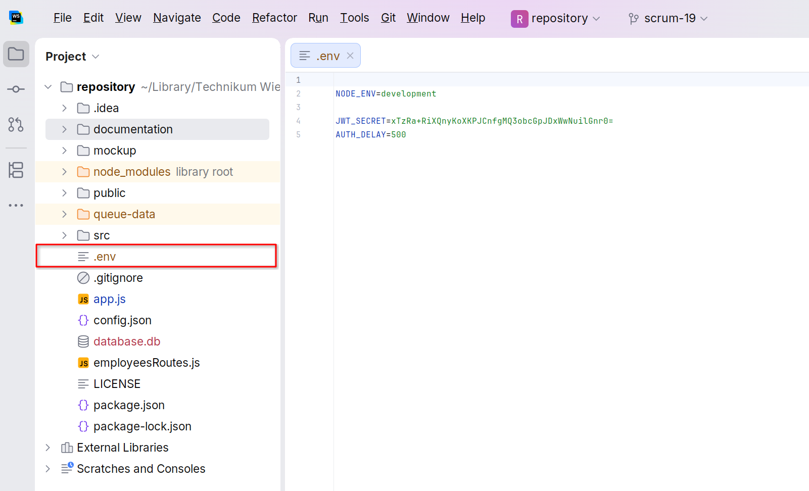
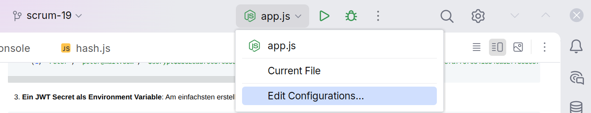
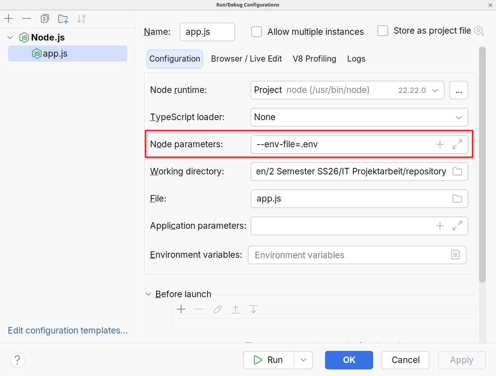

# Hilfe, mit meiner Anwendung stimmt etwas nicht:

Für den kompletten Login flow brauchen wir folgende Dinge:
1. **Eine SQLite Datenbank**. Diese sollte bei jedem Start erzeugt werden und kann bei `/database.db` gefunden werden.
2. **Mindestens einen Datenbank-Eintrag**: Die Datenbank muss einen Angestellten enthalten. Ein Eintrag mit email 'peter@mail.com' und passwort 'passwort' kann so erzeugt werden:<br>
```sql
INSERT into employees
VALUES
    (1, 'Peter', 'peter@mail.com', '$scrypt$bb32eadf965f658ec2184c94e02b780a$55fe3d104b82a22612e843a60cde62079f98b7d7efa770f6341354ca32775cb05747ba9a7ff5262ec8ff92261678dd678deed67196999932a4bf125db9c08f78', 'admin');
```
3. **Ein JWT Secret als Environment Variable**: Am einfachsten erstellt man eine `.env` Datei die dann von `NodeJS` eingelesen wird:

```dotenv
NODE_ENV=development

JWT_SECRET=xTzRa+RiXQnyKoXKPJCnfgMQ3obcGpJDxWwNuilGnr0=
AUTH_DELAY=500
```

---



---



---

